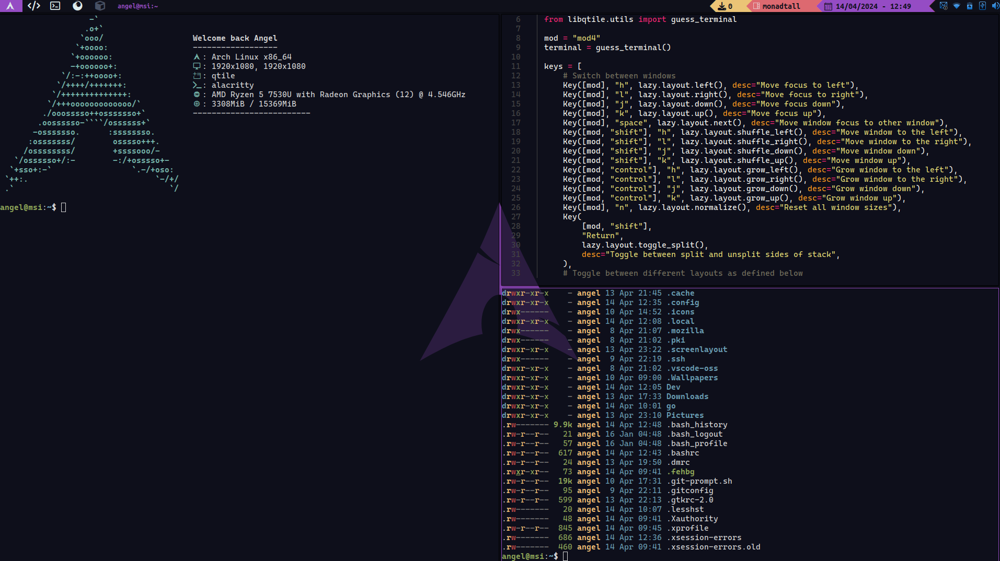
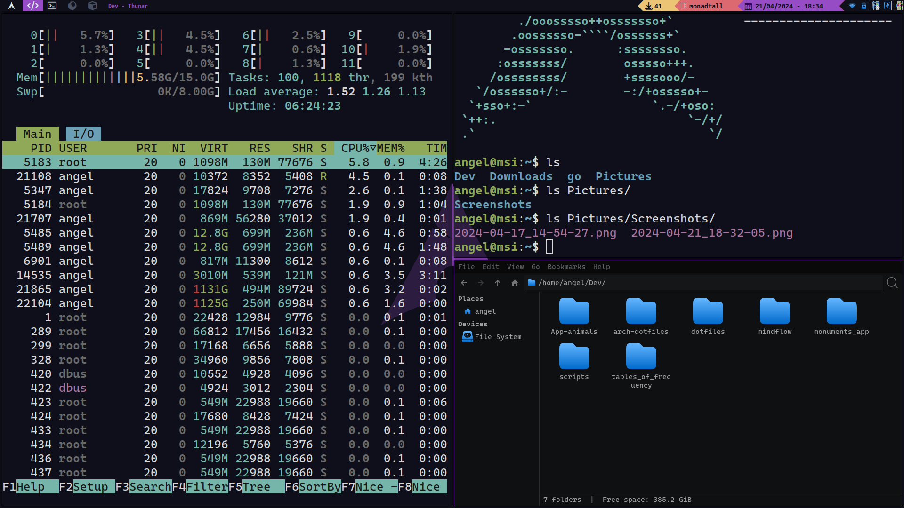
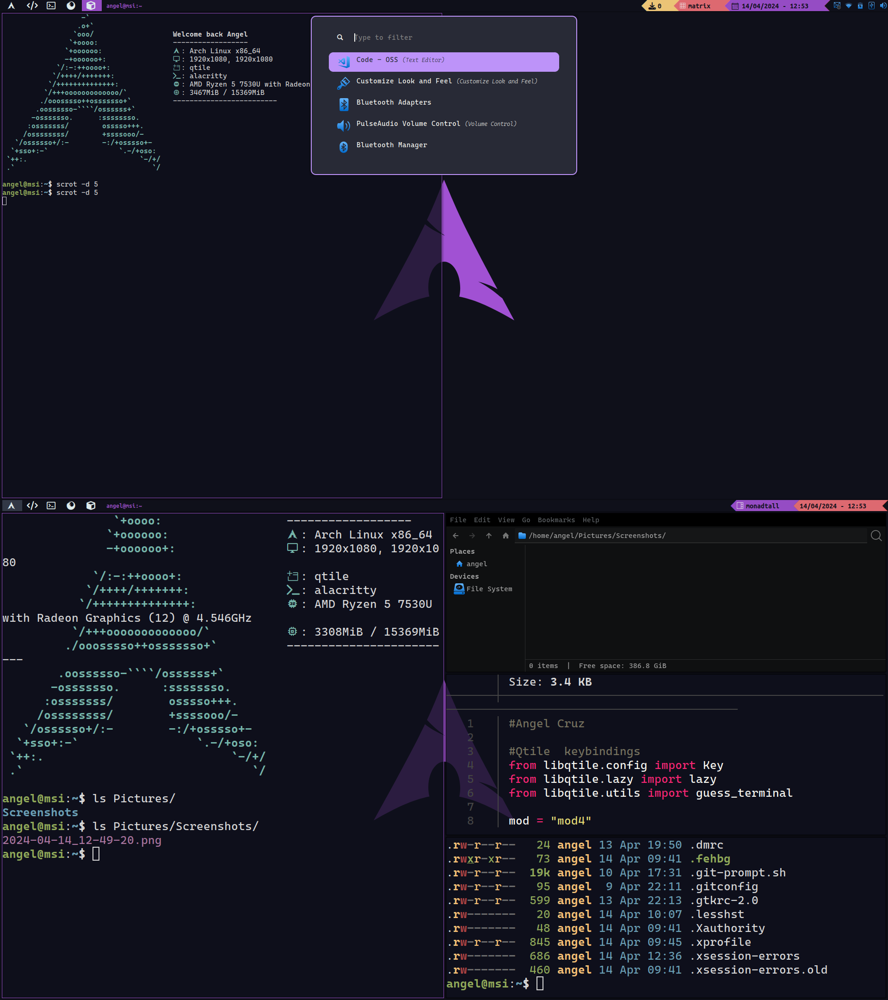

# Dotfiles & Configs Arch Linux

This is my desktop environment on Arch Linux. Currently, this setup is supported on a laptop, an MSI Notebook with an AMD Ryzen 5-7530U processor, and within my personal desktop with support for two monitors, 24 and 26 inches respectively.

# Overview of the enviroment

## Window Manager - Qtile




## Menu - Rofi



# Table of contents

- [Dotfiles \& Configs Arch Linux](#dotfiles--configs-arch-linux)
- [Overview of the enviroment](#overview-of-the-enviroment)
  - [Window Manager - Qtile](#window-manager---qtile)
  - [Menu - Rofi](#menu---rofi)
- [Table of contents](#table-of-contents)
  - [Overview](#overview)
  - [Arch Installation](#arch-installation)
  - [Login and window manager](#login-and-window-manager)
- [Install](#install)
  - [Window manager, Login Manager, Browser, Terminal, Text editor, Menu, neofetch](#window-manager-login-manager-browser-terminal-text-editor-menu-neofetch)
  - [Audio](#audio)
  - [Brightness](#brightness)
  - [Wallapaper](#wallapaper)
  - [Monitors](#monitors)
- [Keybindings](#keybindings)
  - [Window](#window)
  - [Apps](#apps)
- [Software](#software)
  - [Basic utilities](#basic-utilities)
  - [Fonts, theming and GTK](#fonts-theming-and-gtk)
  - [Apps](#apps-1)

## Overview

This guide will walk you through the process of building a desktop environment starting with a fresh Arch based installation. I will assume that you are comfortable with Linux based operating systems and command line interfaces. Because you are reading this, I will also assume that you've looked through some "tiling window manager" videos on Youtube, because that's where the rabbit hole starts. You can pick any window managers you want, but I'm going to use Qtile as a first tiling window manager because that's what I started with. This is basically a description of how I made my desktop environment from scratch.

## Arch Installation

The starting point of this guide is a right after a complete clean Arch based distro installation.

More info [Installation](/.install/README.md)...

## Login and window manager

First, we need to be able to login and open some programs like a browser and a terminal, so we'll start by installing lighdm and qtile. Lightdm will not work unless we install a greeter. We also need xterm because that's the terminal emulator qtile will open by default, until we change the config file. Then, a text editor is necessary for editing config files, you can use vscode or jump straight into neovim if you have previous experience, otherwise I wouldn't suggest it. Last but not least, we need a browser.

# Install

Antes de continuar deberias de tener xorg instalado

```bash
sudo pacman -S xorg
```

## Window manager, Login Manager, Browser, Terminal, Text editor, Menu, neofetch

```bash
sudo pacman -S lightdm lightdm-gtk-greeter lightdm-webkit2-greeter qtile alacritty code firefox rofi neofetch htop

sudo systemctl enable lightdm

```

Use AUR

```bash
sudo pacman -S git

sudo git clone https:aur.archlinux.org/yay-git.git

sudo chown -R youruser:youruser ./yay-git

cd yay-git

sudo pacman -S base-devel

makepkg -si


```

## Audio

```bash
sudo pacman -S pulseaudio pavucontrol
```

## Brightness

Config keys laptop of brightness.

```bash
sudo pacman -S brightnessctl
```

## Wallapaper

Install the software feh to set the wallpaper
Configure your **.xprofile** file to set your background when you boot your PC

```bash
sudo pacman -S feh
feh --bg-scale /path/to/image.jpg
```

## Monitors

Install graphic software for managing monitors

```bash
sudo pacman -S arandr
```

Check the config in [xprofile](/.xprofile)

# Keybindings

These are common keybindings to all my window managers.

## Window

| Key                 | Action                           |
| ------------------- | -------------------------------- |
| mod + j             | next window (down)               |
| mod + k             | next window (up)                 |
| mod + shift + h     | decrease master                  |
| mod + shift + l     | increase master                  |
| mod + shift + j     | move window down                 |
| mod + shift + k     | move window up                   |
| mod + shift + f     | toggle floating                  |
| mod + tab           | change layout                    |
| mod + [1-9]         | Switch to workspace N (1-9)      |
| mod + shift + [1-9] | Send Window to workspace N (1-9) |
| mod + period        | Focus next monitor               |
| mod + comma         | Focus previous monitor           |
| mod + w             | kill window                      |
| mod + ctrl + r      | restart wm                       |
| mod + ctrl + q      | quit termina la tabla            |

The following keybindings will only work if you install all programs needed:

```bash
sudo pacman -S rofi thunar firefox alacritty redshift scrot
```

## Apps

| Key             | Action                      |
| --------------- | --------------------------- |
| mod + m         | Launch rofi                 |
| mod + shift + m | Window nav (rofi)           |
| mod + b         | Lunch Browser(Firefox)      |
| mod + e         | Lunch File explores(thunar) |
| mod + return    | Luch Terminal (Alacritty)   |
| mod + r         | Redshift                    |
| mod + shift + r | Stop redshift               |
| mod + s         | screenshot (scrot)          |

# Software

## Basic utilities

| Software               | Utility                       | Pacman                                |
| ---------------------- | ----------------------------- | ------------------------------------- |
| Networkmanager         | Self explanatory              | sudo pacman -S networkmanager         |
| Alacritty              | Terminal emulator             | sudo pacman -S alacritty              |
| Pulse Audio            | Audio                         | Sudo pacman -S pulseaudio             |
| Vlc                    | Show VIdeo                    | sudo pacman -S vlc                    |
| Qeeqie                 | Show images                   | sudo pacman -S geeqie                 |
| scrot                  | Screenshots                   | Sudo pacman -S scrot                  |
| thunar                 | Graphical file explorer       | sudo pacman -S thunar                 |
| Unzip                  | Descomprimir file             | sudo pacman -S unzip                  |
| xappearance            | Change theme                  | sudo pacman -S lxappearance           |
| xcb-util-cursor        | Change theme cursor           | sudo pacman -S xcb-util-cursor        |
| network-manager-applet | Wifi icon                     | sudo pacman -S network-manager-applet |
| cbattion               | Baterry Icon                  | sudo pacman -S cbattion               |
| notification deamon    | Notification                  | sudo pacman -S notification-daemon    |
| lib notify             | Recibir notificaciones        | sudo pacman -S libnotify              |
| ntfs                   | Leer usb nomtados en wiundows | sudo pacman -S ntfs-3g                |
| neovim                 | Text Editor                   | sudo pacman -S neovim                 |
| exa                    |                               | sudo pacman -S exa                    |
| picom                  | Composer                      | sudo pacman -S picom                  |
| pip                    |                               | sudo pacman -s python-pip             |
| volumen icon           | Icon audio                    | sudo pacman -S volumeicom             |

## Fonts, theming and GTK

| Software              | Utility                                                                |
| --------------------- | ---------------------------------------------------------------------- |
| Alacritty             | Terminal emulator                                                      |
| Exa                   | Pager                                                                  |
| Bat                   | Pager                                                                  |
| UbuntuMono Nerd Fonts | [Font](https://archlinux.org/packages/extra/any/ttf-ubuntu-mono-nerd/) |
| Cascadia Code         | [Font](https://archlinux.org/packages/extra/any/ttf-cascadia-code/)    |
|                       |                                                                        |

## Apps

| Software  | Utility                 |
| --------- | ----------------------- |
| Alacritty | Terminal emulator       |
| Thunar    | Graphical file explorer |
| ranger    | Terminal based explorer |
| scrot     | Screenshot              |
| neovim    | Terminal based editor   |
| rofi      | Take care of yout eyes  |
| trayer    | Systray                 |

Testing your window manager
[Xephyr](https://wiki.archlinux.org/title/Xephyr)
